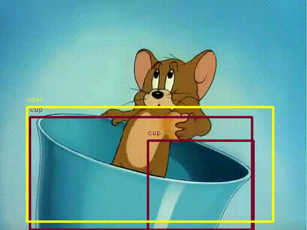
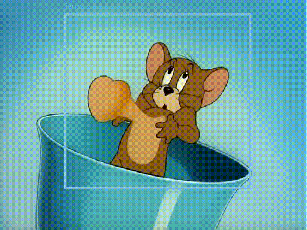
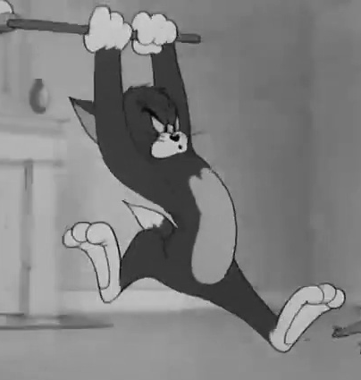
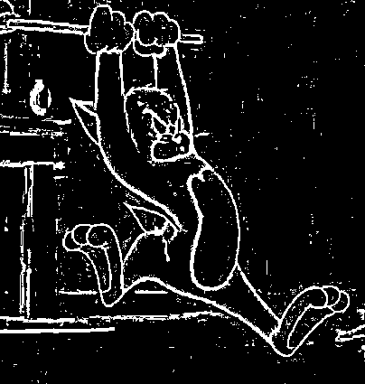
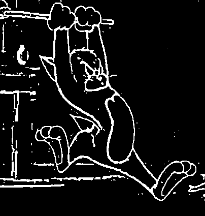
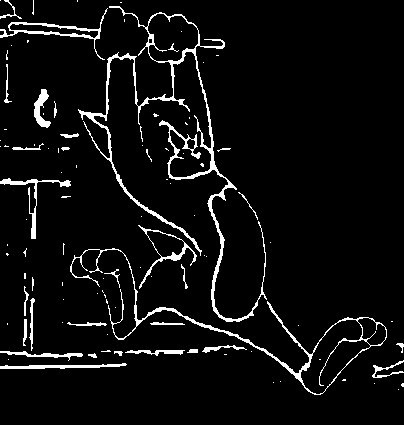
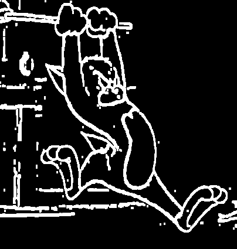
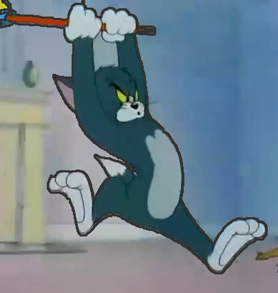
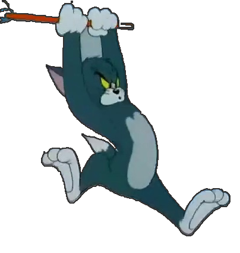
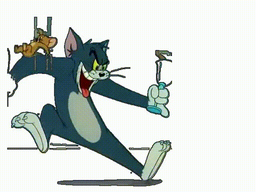

# Cartoons generation
Subject: Image processing

Prof: Mircea Paul Muresan 

## Description

The aim of this project is to generate short animation clips with the help of a neural network. 
In this example the algorithm generates a short clip inspired by the well-knowed cartoons "Tom and Jerry"

The problems along the way, which also define the steps and the timeframe of the project are the following:

1. Creating a databes for tom and jerry
2. Extracting only the character from the frame, without any background
3. Teaching a model the correct sequence of characters and their interraction
4. Predicting frames
5. Composing a short video from the predicted frames

## Creating a database - Yolov2

https://github.com/thtrieu/darkflow

YOLOV2 is a state-of-the-art, real-time object detection system. Their method uses a
hierarchical view of object classification that allows them to
combine distinct datasets together.
It apply a single neural network to the full image. 
This network divides the image into regions and predicts bounding boxes and probabilities for each region. 
These bounding boxes are weighted by the predicted probabilities.

The problem encountered was that yolov2 wasn't trained to detect tom or jerry, instead it had a chaotic output.

I created a small dataset for Tom and jerry using a project on github called yoloAnnotationTool: https://github.com/2vin/yolo_annotation_tool
In the darkflow folder there is the dataset of 336 images, along with the xml that contain the label, amd the coordinates for the surrounding rectangle.

I trained Yolov2 on the custom dataset, and after a few(a lot) of tries it worked well and classified correctly Tom and Jerry.
In darkflof folder in darkflow2.py are all the commands I used to custom train the model. In the weights folder are the weights obtained and also the dataset with the correspondin txt and xml annotations.

## Extracting the caracter from the image

After the Yolo model was trained I started to process the images. Each classification returned the label and the surroundimg rectangle. But more then a cropped image I neede to store only the pixels that contained the character, and not the background.
First of all, I grayscaled and binarized the image too see how hard will it be for the algorithm to extract the caracter and how much noise is there.  

 
Because there was a lot of noise in the image I had to get rid of it. After several tests I decided to use median blur.The Median blur operation is an averaging method. The central element of the image is replaced by the median of all the pixels in the kernel area. This operation processes the edges for removing the noise.After the blur there was still some noise so I used an erosion  

 
Now the image was clear, but the contour of the character was interrupted. I needed to unify the contour, so I used a dilation. Then, with find contours, I took the biggest contour from the image (which was my character) and draw it.  

 
Last but not least, I created a mask with all the pixels from inside the contour. I created a 4 channel image, and set all pixels except from the character pixels with opacity 0, and then copied the object pixels from the original image. 

  

With the algorithm mentioned above I parsed each frame of the movie, saving all the data in a csv file.
In the csv file was saved the x and y coordinates of Tom, along with the png, and the x and y coordinates of Jerry with their corresponding png. In case a character was not in a frame, the data was -1 on all 3 fields. In order to represent accurately the timimng of the data, I considered that each frame is a clue to the next one. So after the 6 columns mentioned above, there was a prediction regarding the next frame. The prediction at this step were the exact coordinates and coorresponding png of the characters from the next frame.
And in this way it was generated the csv, that can be found in model/data.txt, with the following header

x_tom,y_tom,photo_tom,x_jerry,y_jerry,photo_jerry,pred_x_tom,pred_y_tom,pred_photo_tom,pred_x_jerry,pred_y_jerry,pred_photo_jerry

## Model and more data preprocessing

For the model I used a MimMaxScaler to scale all data between -1 and 1. For the neural network I used a LSTM layer combined with a fully connected layer with 6 outputs that represent the x and y coordinates of Tom, along with the png, and the x and y coordinates of Jerry with their corresponding png. After 150 epochs trainingI considered that the model has trained enough.\\

I took a random number with the corresponding train data. From that data, the model predicted 20 frames forward. I repeated the process for 20 times.
Then, I took all predictions and scaled them inverse to obtain the right data, and saved them in a txt. One of the txt can be found in model/model_predict3.txt.

## Frame composition and video generation

At this step in the file model_predict are the frames encoded as numbers: x and y coordinates of Tom, along with the png, and the x and y coordinates of Jerry with their corresponding png. For every prediction of the model, I created a new frame with the size of the initial frame. Then, I composed the predicted png at the predicted locations, building the frame of the video. Because of the transparent pixels, the character can overlap. The code is in generate_video/compose_frames.py

After the generation of the frames, I have written a short script that takes all the frames in order and combines them in an avi file. The script is in generate_video/generate_video.py

